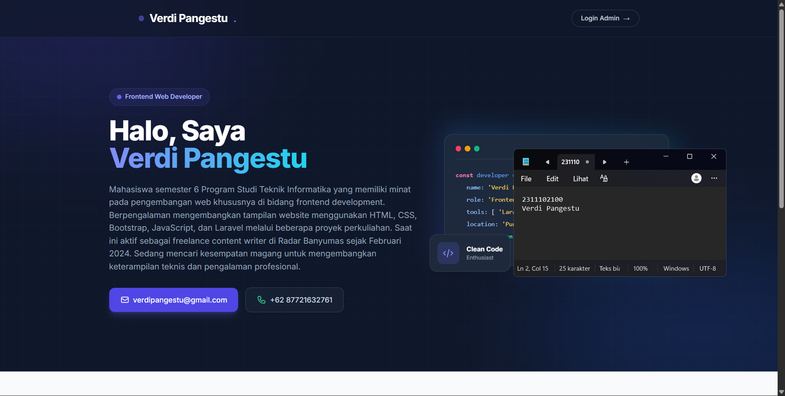
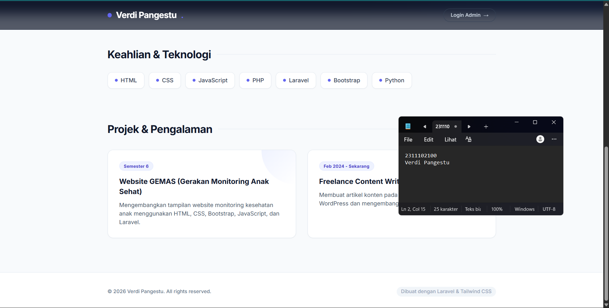
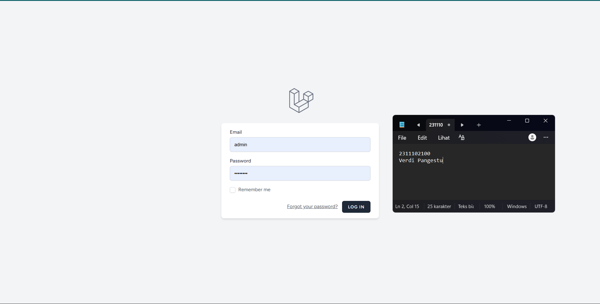
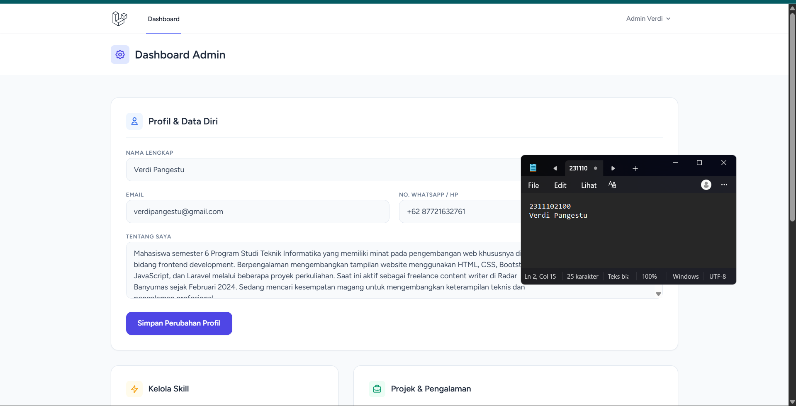
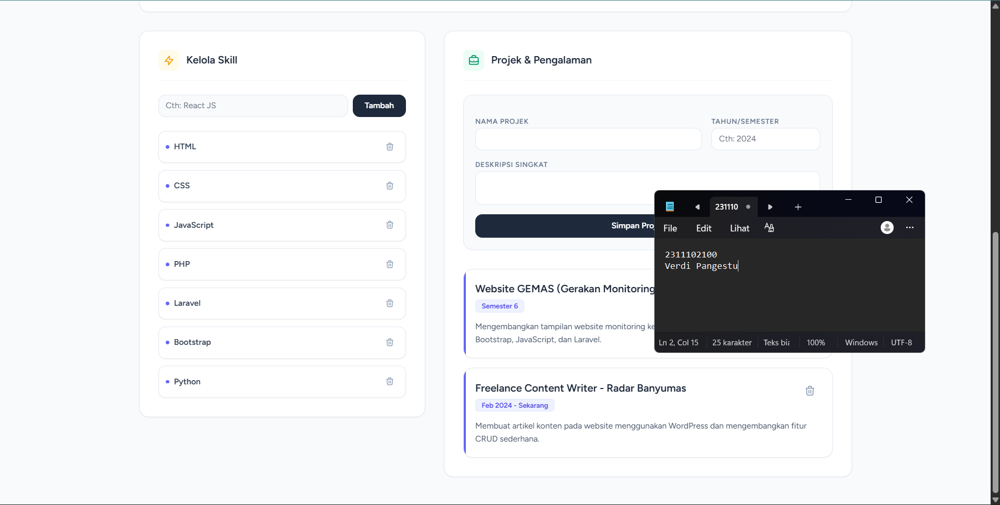

# Ujian Tengah Semester

Silahkan upload tugas yang sudah diberikan beserta source code nya di folder masing masing

## Task

- Buat laporan dalam format Markdown file dengan penamaan README.md
- Upload Source Code dengan format yang sudah ditentukan sebelum nya (tugas-1, tugas-2, etc)
- Tambahkan watermark pada source code dan juga laporan (harus mengandung nim dan nama)

## Langkah Langkah Membuat Folder (khusus windows)

Membuat Folder terlebih dahulu dengan format NIM_Nama

~~~bash
mkdir "2311102081_Apri Pandu Wicaksono"
~~~

Pindah ke folder yang sudah di buat

~~~bash
cd "2311102081_Apri Pandu Wicaksono"
~~~

Lanjut Membuat File README

~~~bash
echo "" >> README.md
~~~

## Note

- Upload harus lewat github CLI, bukan menggunakan fitur drag and drop atau by platform github langsung
- Laporan praktikum berisi kan nama, logo, identitas, dan cover dan di upload dengan format README.md
- Di dalam folder masing masing mahasiswa harus berisi laporan (README.md, source code, dan file screenshot)

## Reference

- [Akses Materi](https://artk.my.id/modul-praktikum-abp)
- [Akun Github](https://artk.my.id/akun-github-abp-05)

#### Halaman Publik
1. **Beranda.png** - Tampilan beranda.

2. **Beranda.png** - Tampilan scroll beranda.

3. **login.png** - Tampilan halaman login.

4. **admin** - Tampilan halaman admin.

5. **admin** - Tampilan scroll admin.

